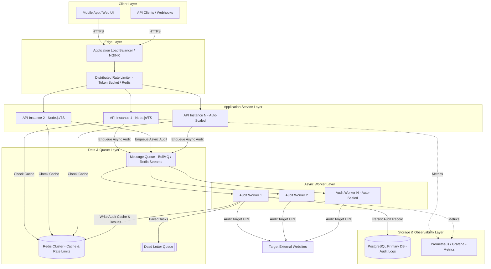

# Task B: Design for Scale — PagePulse Architecture & System Design

## 1. System Overview & Scalability Requirements

The PagePulse service must scale from a basic single-instance service to a resilient, high-throughput microservice architecture capable of handling **10,000+ audits per day**, with **burst loads of 500 concurrent requests**, while maintaining strict customer SLAs (p95 response time < 500ms for cached items, async feedback within 200ms for uncached audits).

---

## 2. System Architecture Diagram

---

## 3. Data Flow & Queueing Strategy

### 3.1 Synchronous vs. Asynchronous Read/Write Flow

1. **Cache Hit Path (Fast Path)**:
   - Request reaches Load Balancer -> Distributed Rate Limiter check in Redis.
   - API layer queries Redis Cache by normalized URL hash.
   - If present, returns `200 OK` with `X-Cache: HIT` within **< 15ms**.

2. **Cache Miss / Burst Path (Asynchronous Queueing)**:
   - If absent, API generates a `jobId` / `requestId`, publishes an audit job to **BullMQ / Redis Streams**, and registers a short-polling or WebSocket listener.
   - For synchronous API compatibility, API waits up to `3000ms` on a Redis Pub/Sub channel for worker completion.
   - If job completion exceeds synchronous threshold, returns `202 Accepted` with a status polling endpoint `GET /api/v1/jobs/:jobId`.

### 3.2 Queueing & Backpressure Management

- **Queue Isolation**: Separate queues for High Priority (Paid tier), Normal Priority, and Retry Queue.
- **Concurrency Bounds**: Each worker consumes up to 25 concurrent HTTP audit tasks utilizing an internal semaphore.
- **Rate Limit per Target Host**: Domain-level throttling (max 2 requests/sec per target domain) to avoid unintentional DDoS on audited third-party servers.

---

## 4. State Management Matrix

| State Type | Component | Tech Stack | Eviction / Persistence Policy |
| :--- | :--- | :--- | :--- |
| **Rate Limit Counters** | Edge / Middleware | Redis Cluster | Sliding Window TTL (60s) |
| **Audit Result Cache** | Fast Read Layer | Redis Cluster | LRU Eviction, Configurable TTL (60s - 3600s) |
| **Job Queue & Retry** | Task Pipeline | BullMQ / Redis | Persistence to AOF disk; DLQ after 3 failures |
| **Audit Analytics & History** | Permanent Store | PostgreSQL | Partitioned by month; indexed by URL hash & timestamp |
| **Request Correlation** | Context Middleware | Request ID Header | In-memory request context propagation |

---

## 5. System Design Principles Applied (SOLID)

1. **Single Responsibility Principle (SRP)**: Separated API ingestion, validation, queuing, execution, and persistent logging into decoupled modules.
2. **Open/Closed Principle (OCP)**: Caching layer and Worker engines use clean interface contracts (`ICacheService`, `IAuditEngine`), enabling seamless migration from Redis to Memcached or Kafka without breaking existing code.
3. **Liskov Substitution Principle (LSP)**: `RedisCache` and `InMemoryCache` strictly implement `ICacheProvider`, allowing transparent swapping in test/dev vs production environments.
4. **Interface Segregation Principle (ISP)**: Clients depend only on specific small interfaces (`IUrlValidator`, `IRateLimiter`, `IAuditReporter`) rather than monolithic interfaces.
5. **Dependency Inversion Principle (DIP)**: High-level controllers depend on abstractions (`IAuditService`), initialized via Dependency Injection.
